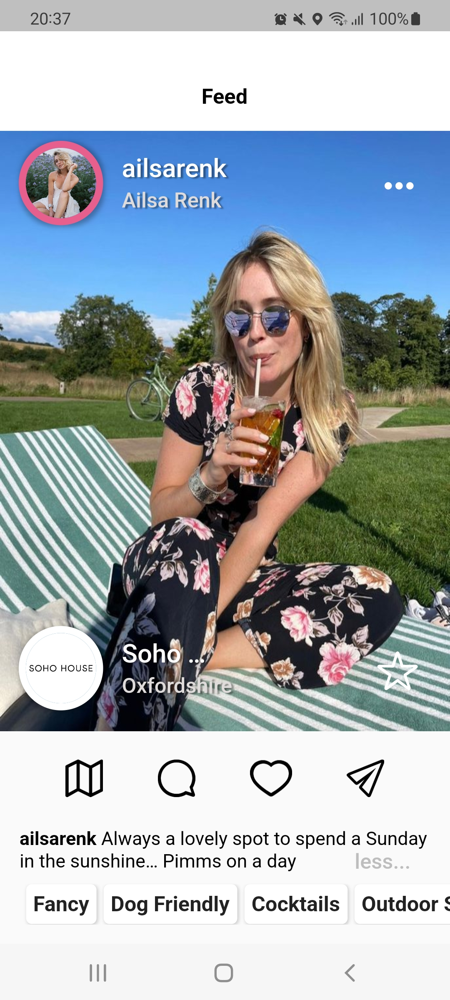
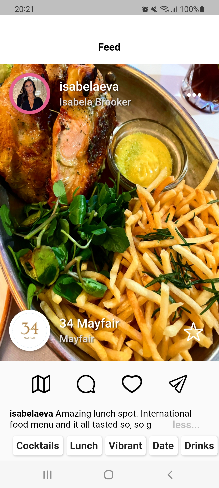
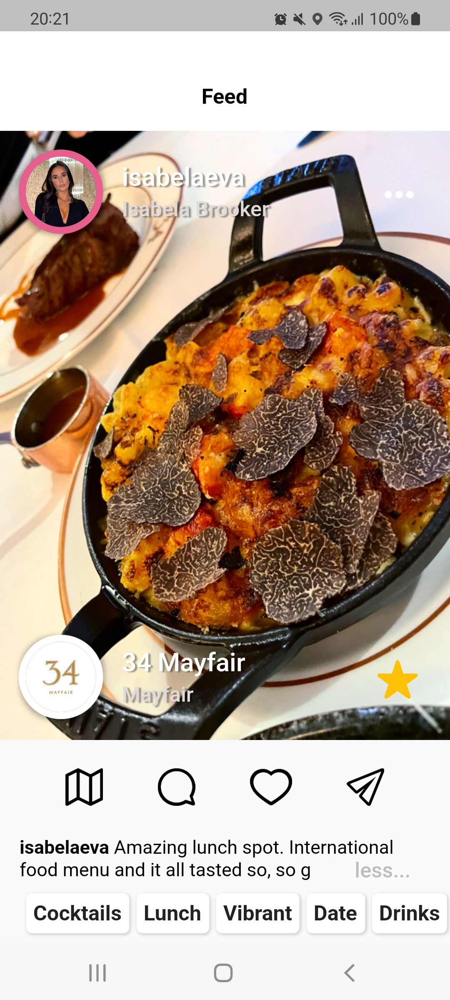
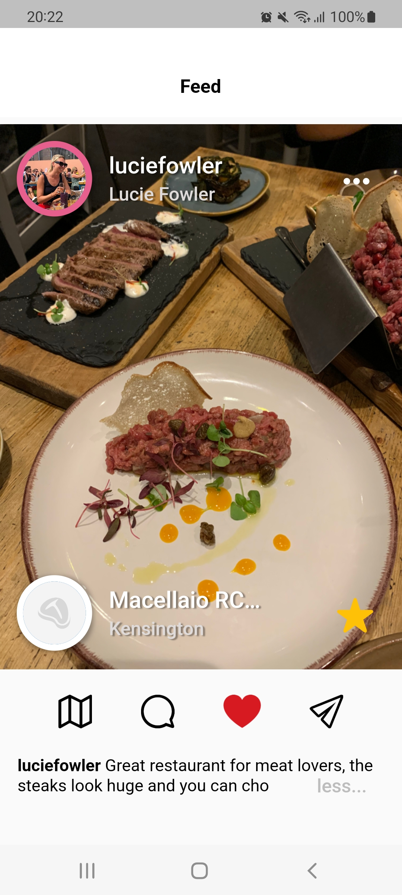
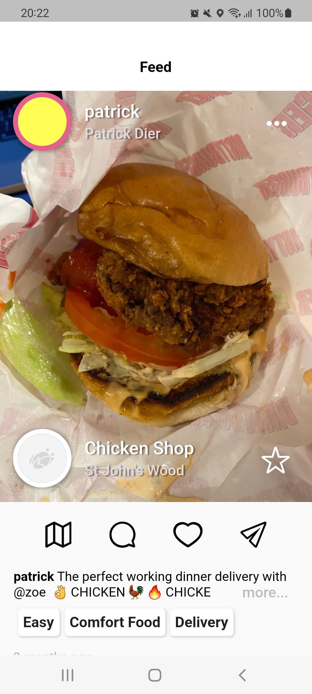
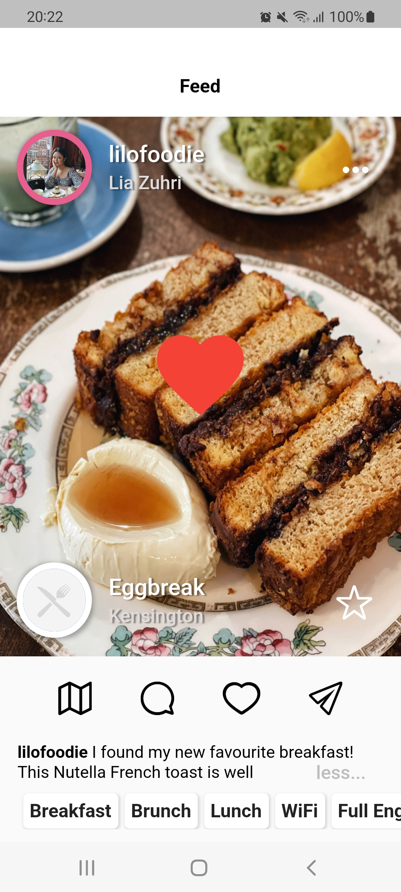

# Feed Tab App for Food Lovers

This app is a social media for those ones who loves food and explore restaurants and food spots. Its has features such as:
recommendation view, toolbar, caption (text) and tags.

  
  
  
  
  
  
  

# App Overview
 
This app is composed by: infinite scrolling, smooth pagination through pictures, MVVM architecture,
simple animation (the heart shown in the middle of the picture when tapped twice), ValueNotifier, setState, and Provider 
for state management and dependency injection.

# Supported State Management Solutions
  
- [ValueNotifier]
- [Provider](https://pub.dev/packages/provider)
- [setState method]
  
# Packages 

- [Cupertino Icons](https://pub.dev/packages/cupertino_icons)
- [Dio](https://pub.dev/packages/dio)
- [Provider](https://pub.dev/packages/provider)
- [Carousel Slider](https://pub.dev/packages/carousel_slider)
- [Timeago](https://pub.dev/packages/timeago)

# Future Roadmap

- N/A

